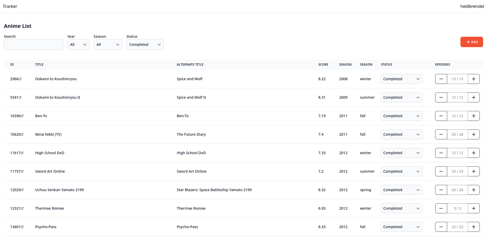

# Anime Tracker

Alternative frontend for My Anime List.



## Features

- List current anime list entries
- Add entries to anime list
- Update watch status and number of watched

## Usage

To use an api client for My Anime List is required.
Define the client id and client secret in the dotenv.
A client can be created [here](https://myanimelist.net/apiconfig).

Also define a secure random string that will be used to generate a secret key and iv value in the dotenv.
This is used for encrypting session information in the cookie.

For example, you can use:

```shell
cat /dev/urandom | tr -dc 'a-zA-Z0-9' | fold -w 64 | head -n 1
```

## To-Do

- Logout button and function
- Styling
